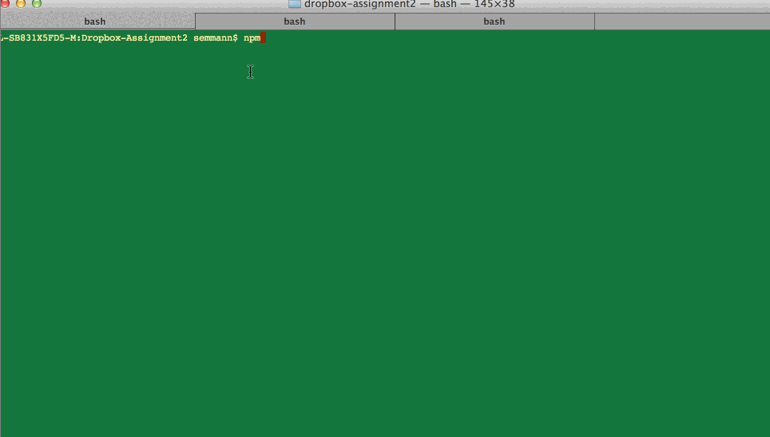

## Dropbox

This is a basic Dropbox demo perform CURD (get,post,put,delete) using express.
Time spent: `8 hours`

### Features

#### Required

- [x] Make GET requests to get file or directory
- [x] Download a directory as an archive
- [x] Make HEAD request to get just the GET headers
- [x] Make PUT requests to create new directories and files with content
- [x] Make POST requests to update the contents of a file
- [x] make DELETE requests to delete files and folders
- [x] Server will sync `HTTP` modifications over TCP to the Client
- [x] Server will sync watched file modifications  over TCP to the Client

### Optional

- [ ] Client supports multiple connected clients
- [x] Client does not need to make additional `GET` request on `"write"` update
- [ ] Client and User will be redirected from HTTP to HTTPS
-

### Walkthrough

